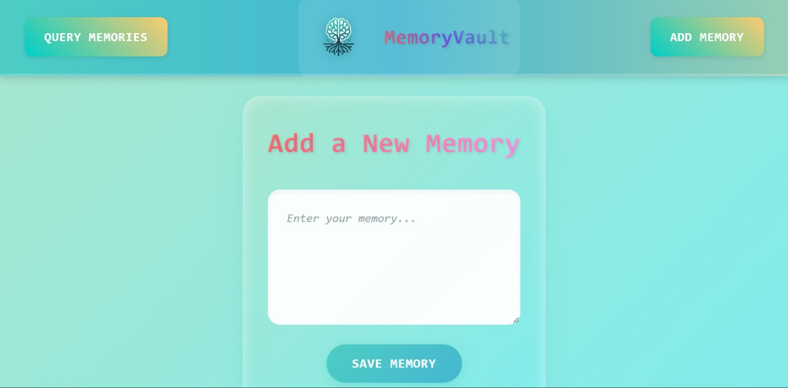
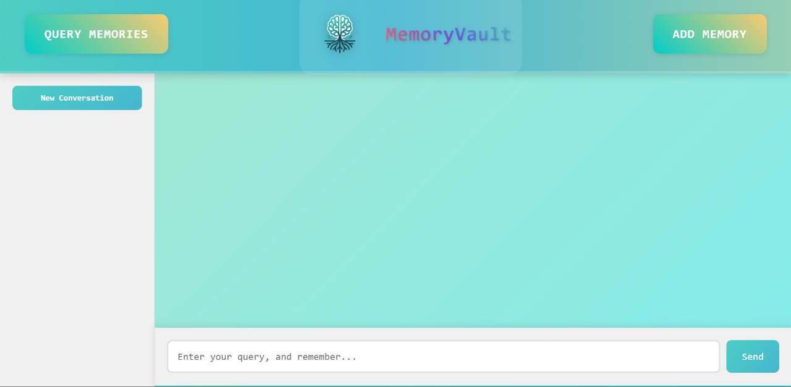

# MemoryVault

## Objective
Alzheimer's disease causes severe memory loss, leading to patients losing connection with their identities and cherished moments. Current solutions lack an interactive approach to reviving lost memories. MemoryVault is an AI-powered platform designed to help Alzheimer's patients relive their memories through conversation and visual experiences. It enables users to interact with their past, fostering emotional well-being and engagement through advanced AI models.

## Implementation

### Core Features
- **AI-Powered Memory Retrieval:** Enables patients to converse with their own memories through natural language interactions.
- **Easy Memory Input:** Users or their families can add memories through a simple interface.
- **Vector Database Storage:** Memories are indexed in a vector database for efficient retrieval.
- **Memory Search & Retrieval:** The system fetches relevant memories based on user queries.
- **Narrative Response:** GPT-4 generates a detailed retelling of retrieved memories.
- **Interactive Experience:** Patients can recall and interact with their memories through engaging dialogues.
- **Family Involvement:** Provides a shared space for families to cherish and relive past moments together.

## Tech Stack & Workflow

### Frontend
- Built using **React.js**, HTML/CSS
- Deployed on **Vercel** for seamless UI

### Backend
- Developed with **Flask (Python)**
- Containerized using **Docker**
- Hosted on **Google Cloud Run**

### Memory Processing
- Memories are split into smaller chunks and embedded using **sentence-transformers/all-mpnet-base-v2**.
- These embeddings are stored in **Pinecone** for fast and efficient retrieval.

### Query Handling
- User queries are embedded and matched against stored memories using **LangChain**.
- Relevant memories are narrated by **Gemini-pro**.

### Key Integrations
- **Gemini APIs**
- **Pinecone**
- **LangChain**
- **Vercel**
- **React**

## Applications & Target Users
MemoryVault serves a broad range of users and institutions:

- **Families of Alzheimer's Patients** – Helps families reconnect with their loved ones' past experiences.
- **Elderly with Early-Stage Alzheimer's** – Allows seniors to recall memories independently.
- **Memory Care Homes** – Enhances patient care and emotional engagement.
- **Doctors & Therapists** – Can be used as a cognitive therapy tool in medical settings.
- **Researchers** – Provides a platform for studying memory and cognitive health.
- **General Users** – Anyone who wants to preserve and revisit cherished memories.

## Business Model & Future Plans

### Monetization Strategies
- **Subscription-Based Model** – Paid plans for families and caregivers to access premium features.
- **Freemium Model** – Basic features for free with upgrades for unlimited storage and advanced visuals.
- **B2B Licensing** – Partnering with memory care homes and healthcare providers.
- **Partnerships** – Collaborations with Alzheimer’s associations and memory care brands.

### Future Enhancements
- **User Authentication System** – Personalized experiences for individual users.
- **Text-to-Speech Integration** – LLM responses converted to audio for enhanced immersion.
- **Memory Editing & Management** – Ability to modify, delete, or organize memories.
- **Enhanced AI Features** – More advanced AI-generated imagery and voice-based memory recall.

## Media

### Screenshots

### Video
<video width="600" controls>
  <source src="Image/MemoryValut - Made with Clipchamp.mp4" type="video/mp4">
  Your browser does not support the video tag.
</video>

MemoryVault is more than just an AI system—it’s a way to bring memories back to life for those who need them the most.

